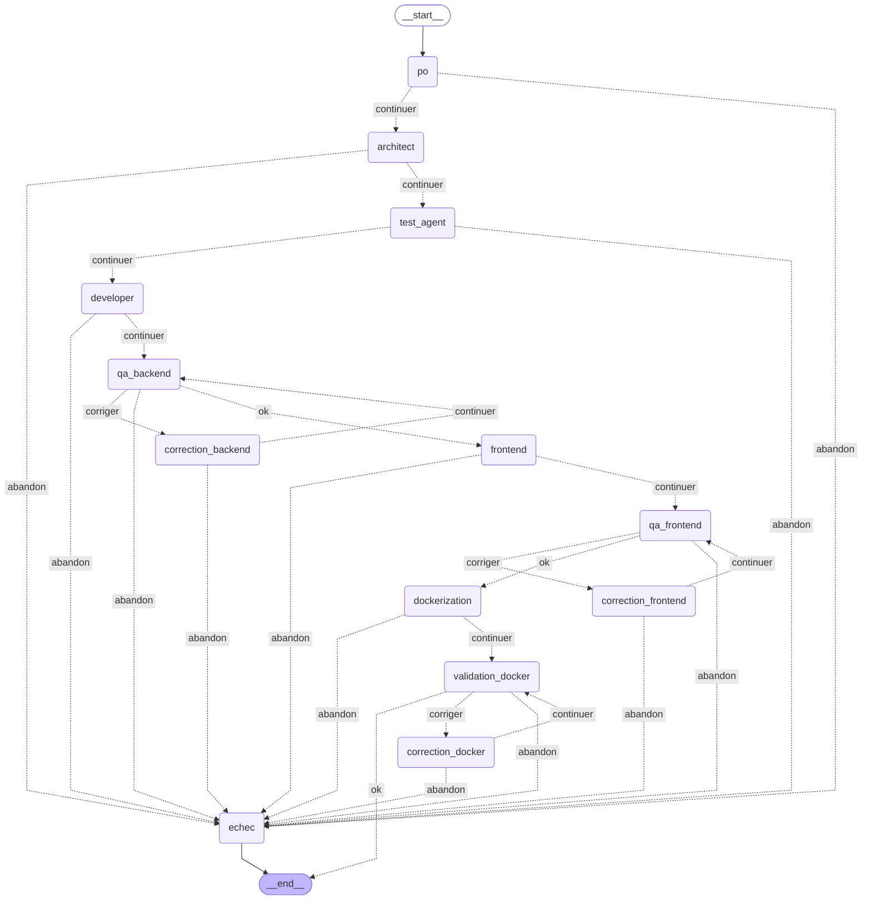

# Graphe du pipeline AutoDev

Genere automatiquement depuis `src/agent_orchestrateur/graphe.py` : ne pas modifier a la main,
relancer `make graphe` apres toute modification du graphe.

- trait plein : enchainement inconditionnel
- pointilles : decision du routage (`ok` / `corriger` / `abandon` / `continuer`)

